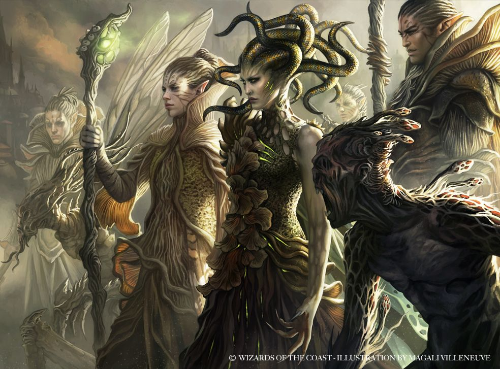

# Golgari swarm

Lorem ipsum.....

## Golgari characters
**Alignment**: Usually X, often Y

**Sugested Races**: races

**Suggested Classes**: classes

You might enjoy a character who belongs in the Golgari if one or more of the following statements are true:
* lorem ipsum...
* lorem ipsum...
* lorem ipsum...
* lorem ipsum...

## Character background: Golgari agent

#### How do I fit in?
lorem ipsum.....

**Skill proficiencies**: 
* insight 
* Intimidation

**Languages**: 
Two of your choice

**Equipment**: 
* A golgari insignia
* 
* 
* 

### Feature: 

### Golgari guild spells

| **Spell level**   | **Spells**
| -                 | -
| cantrip           | 
| 1st               | 
| 2nd               | 
| 3rd               | 
| 4th               | 
| 5th               | 

### Suggested characteristics

#### Personality traits

| **d8** | **Trait**
| -      | -
| 1      | 
| 2      | 
| 3      | 
| 4      | 
| 5      | 
| 6      | 
| 7      | 
| 8      | 

#### Ideals

| **d6** | **Ideal**
| -      | -
| 1      | 
| 2      | 
| 3      | 
| 4      | 
| 5      | 
| 6      | 

#### Bonds

| **d6** | **Bond**
| -      | -
| 1      | 
| 2      | 
| 3      | 
| 4      | 
| 5      | 
| 6      | 

#### Flaws

| **d6** | **Flaw**
| -      | -
| 1      | 
| 2      | 
| 3      | 
| 4      | 
| 5      | 
| 6      | 

### Golgari contacts

| **d6** | **Contact**
| -      | -
| 1      | 
| 2      | 
| 3      | 
| 4      | 
| 5      | 
| 6      | 

### Non-Golgari contacts

| **d10** | **Contact**
|  -      | -
|  1      | 
|  2      | 
|  3      | 
|  4      | 
|  5      | 
|  6      | 
|  7      |
|  8      | 
|  9      |
| 10      |
