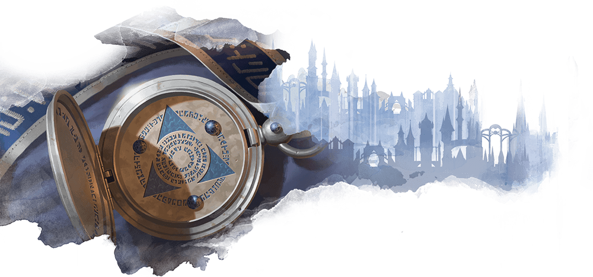
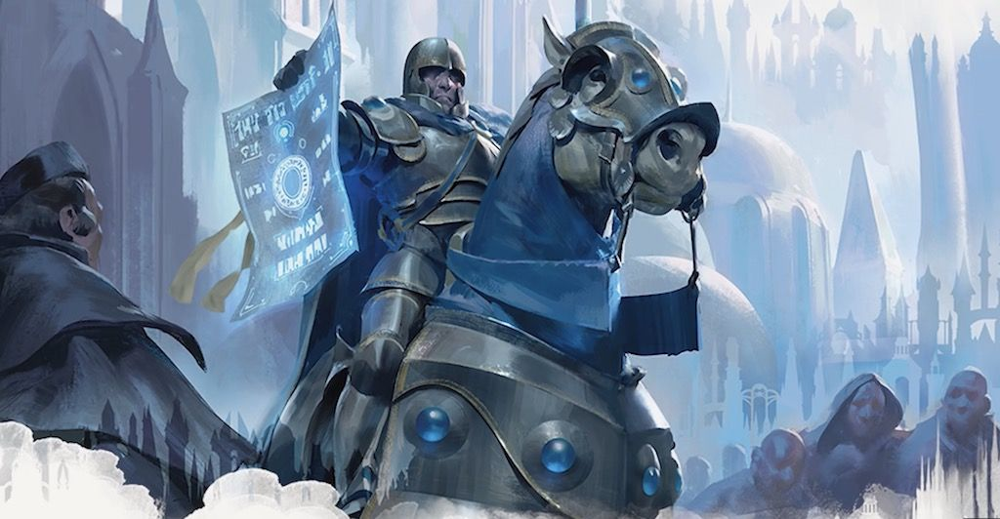

# The Azorius senate

Lorem ipsum.....

## Azorius characters'

**Alignment**: Usually lawful, often neutral

**Sugested Races**: Human, vedalken

**Suggested Classes**: bard, cleric, fighter, paladin, wizard

You might enjoy a character who belongs in the Azorius senate if one or more
of the following statements are true:

* You're drawn to the idea of a hard-bitten police officer trying to impose order on a chaotic world.
* You like the idea of using magic to control enemies.
* You like playing enchanter wizards, clerics of law, or unbending paladins

## Character background: Azorius functionary

### How do I fit in

lorem ipsum.....

**Skill proficiencies**:

* insight
* Intimidation

**Languages**:
Two of your choice

**Equipment**:

* An Azorius insignia
* a scroll contining the text of a law important to you
* a bottle of blue ink, a pen, a set of fine clothes
* a belt pouch containing 10 gp (Azorius-minted 1-zino coin)

### Feature

### Azorius guild spells

| **Spell level** | **Spells** |
| --------------- | -----------|
| cantrip         | friends, message
| 1st             | command, ensnaring strike
| 2nd             | arcane lock, calm emotions, hold person
| 3rd             | clairvoyance, counterspell
| 4th             | compulsion, divination
| 5th             | dominate person

### Suggested characteristics

#### Personality traits

| **d8** | **Trait** |
| ------ | ----------|
| 1      | I try never to let my judgement become clouded by emotion.
| 2      | I have infinite patience with the dolts and boors I'm forced to deal with every day.
| 3      | When I givenan order, I expect them to be obeyed
| 4      | I just want things in the way I like them: neat, orderly, and clean.
| 5      | no wrongdoing can escape my watchful gaze.                                                                |
| 6      | I always say exactly what I mean, no matter how many words it takes to communicate the particular nuance I am attempting to convey.
| 7      | I'm very literal and don't appreciate metaphor or sarcasm.
| 8      | I never change my mind once it's made up.

#### Ideals

| **d6** | **Ideal** |
| ------ | --------- |
| 1      |
| 2      |
| 3      |
| 4      |
| 5      |
| 6      |

#### Bonds

| **d6** | **Bond** |
| ------ | -------- |
| 1      |
| 2      |
| 3      |
| 4      |
| 5      |
| 6      |

#### Flaws

| **d6** | **Flaw** |
| ------ | -------- |
| 1      |
| 2      |
| 3      |
| 4      |
| 5      |
| 6      |

### Azorius contacts

| **d6** | **Contact** |
| ------ | ----------- |
| 1      |
| 2      |
| 3      |
| 4      |
| 5      |
| 6      |

### Non-Azorius contacts

| **d10** | **Contact** |
| ------- | ----------- |
| 1       |
| 2       |
| 3       |
| 4       |
| 5       |
| 6       |
| 7       |
| 8       |
| 9       |
| 10      |
