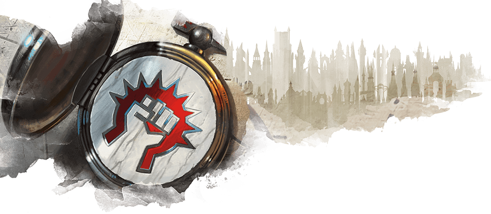
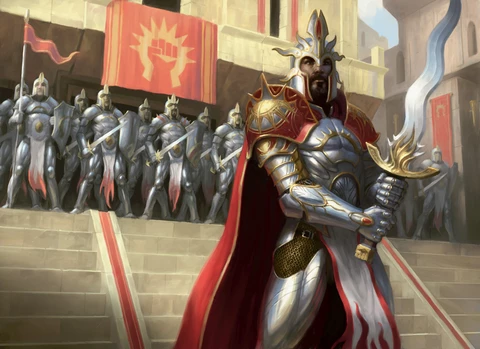

# Boros Legion

Lorem ipsum.....

## Boros characters

**Alignment**: Usually X, often Y

**Sugested Races**: races

**Suggested Classes**: classes

You might enjoy a character who belongs in the Boros if one or more of the
following statements are true:

* Proident sunt consequat consequat nulla.
* Quis dolor adipisicing qui deserunt sunt duis sunt cillum aliquip est veniam duis.
* In ullamco elit quis voluptate cillum incididunt duis anim qui enim sunt ut.
* Cillum esse sit officia officia ut non.

## Character background: Boros Legionnaire

### How do I fit in

Proident laboris pariatur ad enim ipsum veniam adipisicing excepteur enim esse incididunt sunt.

**Skill proficiencies:**

* insight
* Intimidation

**Languages:**
Two of your choice

**Equipment:**

* A boros insignia
* Et sint pariatur est reprehenderit.
* Exercitation et sit ex dolor voluptate ut.
* Sunt excepteur occaecat sit esse ullamco ad ex consequat ipsum est adipisicing.

### Feature

### Boros guild spells

| **Spell level** | **Spells** |
| --------------- | ---------- |
| cantrip         |
| 1st             |
| 2nd             |
| 3rd             |
| 4th             |
| 5th             |

### Suggested characteristics

#### Personality traits

| **d8** | **Trait** |
| ------ | --------- |
| 1      |
| 2      |
| 3      |
| 4      |
| 5      |
| 6      |
| 7      |
| 8      |

#### Ideals

| **d6** | **Ideal** |
| ------ | --------- |
| 1      | **Guild.** My guild is all that really matters
| 2      |
| 3      |
| 4      |
| 5      |
| 6      |

#### Bonds

| **d6** | **Bond** |
| ------ | -------- |
| 1      |
| 2      |
| 3      |
| 4      |
| 5      |
| 6      |

#### Flaws

| **d6** | **Flaw** |
| ------ | -------- |
| 1      |
| 2      |
| 3      |
| 4      |
| 5      |
| 6      |

### Boros contacts

| **d6** | **Contact** |
| ------ | ----------- |
| 1      |
| 2      |
| 3      |
| 4      |
| 5      |
| 6      |

### Non-Boros contacts

| **d10** | **Contact** |
| ------- | ----------- |
| 1       |
| 2       |
| 3       |
| 4       |
| 5       |
| 6       |
| 7       |
| 8       |
| 9       |
| 10      |
