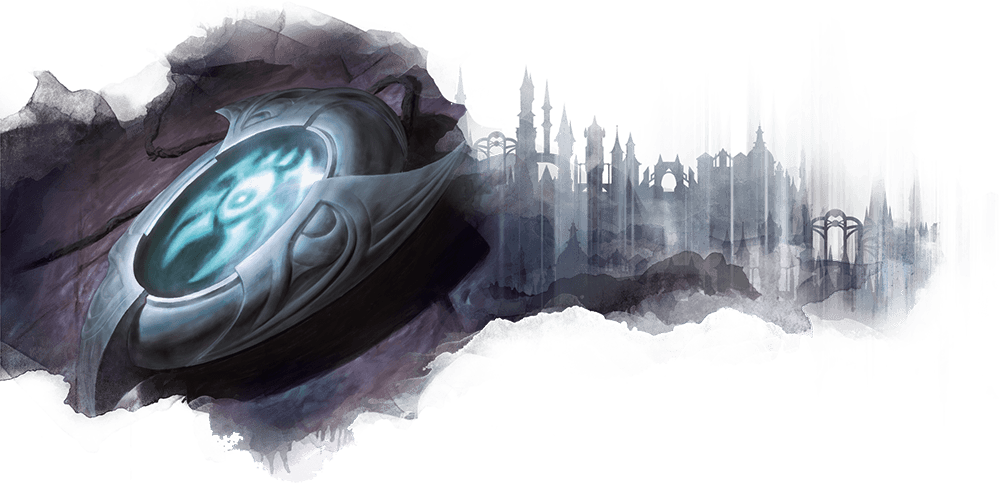
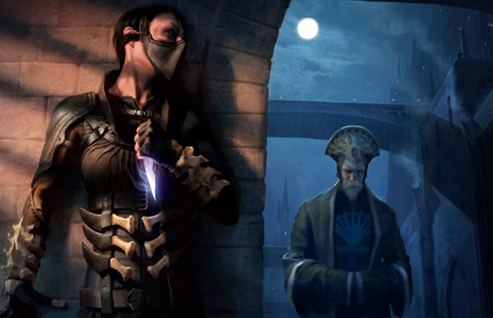

# House Dimir

Nulla do exercitation consequat sunt amet.

## Dimir characters

**Alignment**: Usually X, often Y

**Sugested Races**: races

**Suggested Classes**: classes

You might enjoy a character who belongs in the Dimir if one or more of the following statements are true:

* Cupidatat adipisicing qui aliqua veniam sunt ipsum occaecat nisi est.
* Nulla dolor sunt nulla nisi consectetur sint nostrud.
* Pariatur sint incididunt duis magna sint esse.
* Cupidatat Lorem quis consectetur irure ullamco veniam officia non nostrud ex ullamco eiusmod deserunt sit.

## Character background: Dimir operative

### How do I fit in

Id labore dolor consequat ullamco aliqua incididunt minim incididunt non labore.

**Skill proficiencies:**

* Deception
* Stealth

**Tool proficiencies:**
Disguise kit

**Languages:**:
One of your choice

**Equipment:**

* A dimir insignia
* three small knives
* set of dark-colored common clothes
* starting equipment of the secondary background

### Feature

**False identity:**

You have more than one identity. The one you wear most of the time makes you appear to be a member of a guild other than House Dimir. You have documentation, established acquaintances, and disguises that allow you to assume that persona and fit into the secondary guild. Whenever you choose, you can drop this identity and blend into the guildless masses of the city.

Consider why you're embedded in the secondary guild. Create a story with your DM, inspired by rolling the following table or choosing a reason that suits you.

| **d8**  | **reason for infiltration**
|  1      | My parents belong to this guild, and I let them think I'm following in their footsteps.
|  2      | I've been assigned to track this guild's activities.
|  3      | I've been assigned to get close to an individual in this guild and learn their secrets.
|  4      | I've been assigned to recruit a new Dimir spy from the ranks of this guild.
|  5      | I was a member of this guild before the Dimir recruited me.
|  6      | I don't like what this guild stands for and want to destroy it from within.
|  7      | I secretly wish I could leave the Dimir and join this guild, but there is no escaping the Dimir.
|  8      | I chose this guild at random or on a lark.

### Dimir guild spells

| **Spell level** | **Spells** |
| --------------- | ---------- |
| cantrip         |
| 1st             |
| 2nd             |
| 3rd             |
| 4th             |
| 5th             |

### Suggested characteristics

#### Personality traits

| **d8** | **Trait** |
| ------ | --------- |
| 1      |
| 2      |
| 3      |
| 4      |
| 5      |
| 6      |
| 7      |
| 8      |

#### Ideals

| **d6** | **Ideal** |
| ------ | --------- |
| 1      |
| 2      |
| 3      |
| 4      |
| 5      |
| 6      |

#### Bonds

| **d6** | **Bond** |
| ------ | -------- |
| 1      |
| 2      |
| 3      |
| 4      |
| 5      |
| 6      |

#### Flaws

| **d6** | **Flaw** |
| ------ | -------- |
| 1      |
| 2      |
| 3      |
| 4      |
| 5      |
| 6      |

### Dimir contacts

As an agent of House Dimir working undercover, you have limited contacts
within your guild. Your relationships with your secondary guild, in the guise
of your false identity, are usually more extensive.

Roll once on the Dimir contacts table, giving you an ally who serves as your
contact in Dimir. Then roll twice on the table for your secondary guild.
The first roll gives you an ally there, and the second roll gives you a rival.

| **d8** | **Contact** |
| ------ | ----------- |
| 1      |
| 2      |
| 3      |
| 4      |
| 5      |
| 6      |
