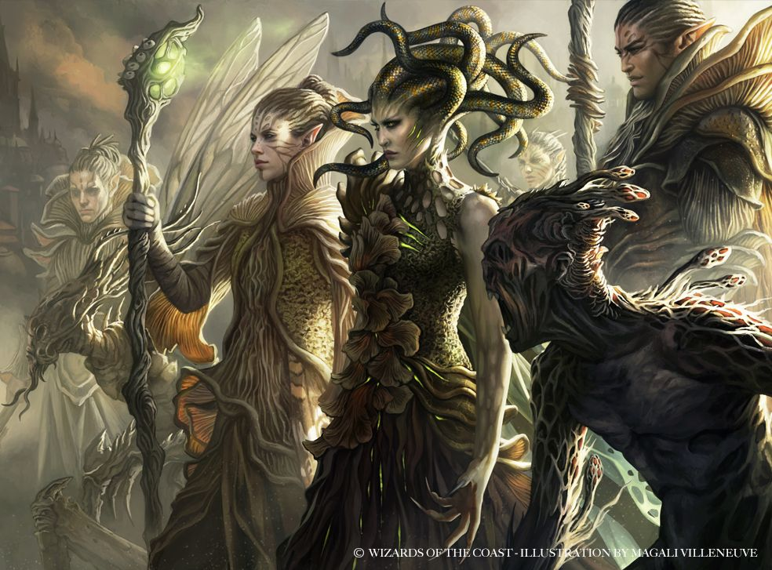

# Golgari swarm

The swarm of Golgari are a collective of people who share an idea of life and
death as part of the cycle of life.
That the concept that these are opposing forces are nothing but naive
sentimentality. Time will always pass, everything will eventually lead to death
and in death, new life will grow. As a result they often grow spores and
other similar forms of growth both on their bodies and in their underground
home.

Golgari call the undercity their home. This is where you usually find their
druids, the humans and dark elves, gorgons, and the liches that decide to
join the afterlife with their rotting old bodies. The undercity is also the
home of other beings such as the sapient insects called the kraul, trolls
and other beings of the dark.

The leadership of this guild has undergone several major changes over time.
However, the guild's adaptive nature and philosophy of life's cycle accepts
all the changes. The current guildmaster is the elf lich Jarad Vod Savo.

The most prominent groups of members in this guild are the dark elves, often
called devkarin elves, the gorgons (also called medusas), and the Kraul. Jarad
is a representative of the Devkarin, so they have claimed a privileged position
in the guild for the moment.

No matter who sits on the top of the leadership, the golgari consider
themselves one, and act as one organism. As a guild, the leader guides the
organism in the direction that they wish, or as advised by the advisors or
high chancellors suggest.

A task is not delegated to specific groups, but rather a message sent out to
the outer ends of the organism. If you have proven yourself worthy,
 you might be named in a task as recognition of your
talents, or you might be sought out by the guildmaster or the advisors
to hear your suggestions.

## Golgari characters

**Alignment**: Usually neutral, often evil

**Sugested Races**: Human, elf (dark)

**Suggested Classes**: druid, fighter, ranger, rogue, wizard

You might enjoy a character who belongs in the Golgari if one or more of
the following statements are true:

* You're drawn to the darker side of nature or the greener side of necromancy
* You're drawn to sinister, creepy, or grim characters
* You like elves and druids but want to explore an unusual direction

## Character background: Golgari agent

**Skill proficiencies:**

* Nature
* Survival

**Tool proficiencies:**
Poisoner's kit.

**Languages:**
Choose one of Elvish, Giant, or Kraul

**Equipment:**

* A golgari insignia
* Poisoner's kit
* Pet beetle or spider
* Set of common clothes
* Belt pouch containing 10 zinos worth of mixed coins

### How do I fit in

Being part of the Swarm, you are a specialised part of the greater organism.
Your orders, when you have such, come from the guildmaster by the high
chancellors, who carry his messages throughout the guild. The swarm relies
on you to protect some part, however small, of its existence. This does not
mean they consider you indespensable; your eventual death is also part of your
purpose and function. As your body would allow more to grow, using it as a
fertiliser.

A classic adventuring role for a member of the Golgari involves crawling through
dungeon-like environments - the sewers and ancient vaults of the undercity -
in search for treasures left behind by the dead. Sometimes you might be sent
out to find a specific item believed to be lost in dangerous parts of the
undercity. At other times you might be asked to collect samples of a specific
fungus, retrievev a body floating in the muck of a sewer, or bring whatever
loot you can help fill the swarm's coffers with. You might also be told to
contend with the threats of hostile monsters enroaching the Golgari-controlled
areas.

If you show prowess as a great asset to the guild and have a great sense of
stealth, you might be given a role called 'Ochran'. They might serve as
stealthy bodyguards or sent out as a burglar or assassin to further the guild's
goals. You might be assigned to steal something because the guild needs it,
or because losing it would bring to another guild, hastening their inevitable
decline.

If you are a spellcaster you might be considered a guild shaman, who use their
magic to accelerate the cycle of decay and regrowth. You might be sent
to spread spores throughout an area that the Golgari wish to claim as their
own territory, or to convince the inhabitants to leave the territory.

### Feature: Undercity Paths

Living in the underground, you learn subterrean pathways that can be used
to bypass crowds, obstacles, and observations as you pass through the city.
When you are not in combat, you can use this to bring yourself and your
companions between any two locations in the city at twice the speed
you normally could. However, these paths are usually crawling with dangers
 that rarely brave the light of the surface world, so the journey is not
 guaranteed to be safe.

### Golgari guild spells

Golgari magic is often accompanied by sickly green glow and a rotting stench.

| **Spell level** | **Spells** |
| --------------- | ---------- |
| cantrip         | Dancing lights, spare the dying
| 1st             | entangle, ray of sickness
| 2nd             | protection from poison, ray of enfeeblement, spider climb
| 3rd             | animate dead, plant growth
| 4th             | giant insect, grasping vine
| 5th             | cloudkill, insect plague

### Suggested characteristics

Members of the Golgari Swarm are unmistakenly products of the undercity,
ill aat ease amid the comforts of civilization. They bring about the same
discomfort in others by reminding them of death's inevitable approach.

#### Personality traits

| **d8** | **Trait** |
| ------ | --------- |
| 1      | Remember, I could kill you in your sleep. Or put centipedes in your bedroll.
| 2      | I like toremind people of their inevitable demise.
| 3      | Sometimes I give voice to the whispers of the rot, which I hear but no one else does.
| 4      | I do my best to discourage anyone from approaching or tlaking to me.
| 5      | I have accepted my d eath. Hence, I don't fear it.
| 6      | Like roots growing through stone, i am relentless and determined in my action.
| 7      | I put my knowledge of anatomy to use by narrating the injuries my enemies suffer in grisly detail.
| 8      | Like a wild animal, I lash out viciously when I'm provoked - and I'm easily provoked.

#### Ideals

| **d6** | **Ideal** |
| ------ | --------- |
| 1      | **Guild.** My guild is all that really matters (Any)
| 2      | **Stoicism.** All of us are part of the cyclical march of nature, which will continue with or without us. (Neutral)
| 3      | **Nature.** The natural world is more important than the edifices of the city and civilization (Neutral)
| 4      | **Interdependence.** We are all part of nature's web. (Lawful)
| 5      | **Ambition.** The time of Golgari ascendance is at hand, and I intend to have a prominent place in the new world order (Evil)
| 6      | **LIve and Let Live.** Meddling in the affairs of other guilds is a great way to be squashed like a bug. (Neutral)

#### Bonds

| **d6** | **Bond** |
| ------ | -------- |
| 1      | I cherish the finger of a family member who was petrified by a gorgon.
| 2      | I have an identical twin who is as different from me as any other person could be.
| 3      | I want to lead one faction of the guild to a new position of dominance.
| 4      | I love spending time in the moss-covered building where I took part in my first reclamation mission.
| 5      | I found something in the sewer that must never come to light.
| 6      | I am forever grateful to the reclaimer who founud me floating facedown in the sewer, moments from death.

#### Flaws

| **d6** | **Flaw** |
| ------ | -------- |
| 1      | Death comes for us all, so you can't expect me to take care of someone who can't fight it off.
| 2      | I assume that anyone outside the GOlgari looks down on me.
| 3      | I feel a need for revenge against those who enjoy the privilege of living above ground.
| 4      | I don't bother to couch my opinions in flattering words.
| 5      | I can't help but pocket any trinket or coin I come across, no matter how worthless.
| 6      | I'm convinced that I'm better and stronger than members of other guilds, isolated as theyu are from the realities of life and death.

### Contacts

To the extent that the Golgari Swarm acts like a single organism, you are connected to every other member in some way or another. Convinced that the rest of the world is out to get you, you find it easy to form close bonds with your guild mates, and harder to make meaningful connections with others.

Roll twice on the **Golgari Contacts** table (for an ally and a rival), and once for the **Non-Golgari contacts** table.

#### Golgari contacts

| **d8** | **Contact** |
| ------ | ----------- |
| 1      | one of my parents is an elite assassin, a member of the Ochran.
| 2      | I learned combat from a kraul.
| 3      | I know a gorgon who is stationed in the guildhall.
| 4      | I had a torrid romance with a spore druid responsible for a large rot farm.
| 5      | there's a troll in a remote area of the undercity who seems to find me interesting - and who knows more than you'd think.
| 6      | An elf lich is determined to see me become a lich someday, too.
| 7      | A gorgon decided it would be more fun to recruit me into the guild than to kill me.
| 8      | I know a findbroker who can locate just about anything, for the right price.

#### Non-Golgari contacts

| **d10** | **Contact** |
| ------- | ----------- |
| 1       | An Azorius arrester I literally pulled out of the gutter will do anything for me.
| 2       | Someone joined the Gruul in a battle against the Boros once, and the sergeant of that Boros squad would love to prove that it was me.
| 3       | I had a romance with a Dimir whom I still feed secrets to.
| 4       | Roll an additional Golgari contact; you can decide if the contact is an ally or a rival.
| 5       | I joined the Gruul in a battle against the Boros once, and the chief of that small clan thanks me for turning the tide.
| 6       | An Izzet scientist resents that I sold a sscrapped invention I found in the sewer.
| 7       | My undercity explorations led me into an Orzhov vault, and a spirit thinks I stole something valuable.
| 8       | I found a baby beast and sold it to a Rakdos wrangler who remains grateful to me.
| 9       | A Selesnya druid and I share an intertest in the same garden, and we have enjoyable arguments there.
| 10      | I regularly pick up refuse from beneath a Simic laboratory, and sometimes I talk to the researcher who dumps it there.
