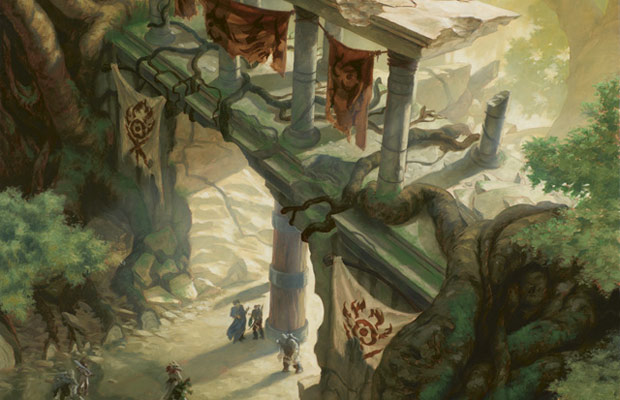

# Gruul clans

Lorem ipsum.....

## Gruul characters
**Alignment**: Usually X, often Y

**Sugested Races**: races

**Suggested Classes**: classes

You might enjoy a character who belongs in the Gruul if one or more of the following statements are true:
* lorem ipsum...
* lorem ipsum...
* lorem ipsum...
* lorem ipsum...

## Joining the gruul clans
You might have been born and raised among the Gruul, like many of the guilds' members. Or you could be an outcast, a refugee, or a fugitive from civilized society, shunned for your violent ways or for fleeing the hand of justice. As long as you are strong enough to survive among the Gruul, you are welcome, no matter what secrets haunt your past. 

The Gruul "guild" is actually a collection of different, independent clans loosely united under one powerful leader. When you decide to join the Gruul, you join a specific clan, not the guild as a whole. You can roll a d8 or choose from the options in the Gruul Clan Options table to determine your character's clan allegiance.

**Gruul clan Options**

| **d8** | **Clan** 
| -      | - 
|  1     | Burning Tree clan
|  2     | Ghor clan
|  3     | Scab clan
|  4     | Slizt clan
|  5     | Gravel-hide clan
|  6     | Zhur-Taa clan
|  7     | Minor or new clan
|  8     | Trog

#### The clans of Gruul
Lorem ipsum....

## Character background: Gruul anarch

#### How do I fit in?
lorem ipsum.....

**Skill proficiencies**: 
* insight 
* Intimidation

**Languages**: 
Two of your choice

**Equipment**: 
* A Gruul insignia
* 
* 
* 

### Feature: 

### Gruul guild spells

| **Spell level**   | **Spells**
| -                 | -
| cantrip           | 
| 1st               | 
| 2nd               | 
| 3rd               | 
| 4th               | 
| 5th               | 

### Suggested characteristics

#### Personality traits

| **d8** | **Trait**
| -      | -
| 1      | 
| 2      | 
| 3      | 
| 4      | 
| 5      | 
| 6      | 
| 7      | 
| 8      | 

#### Ideals

| **d6** | **Ideal**
| -      | -
| 1      | 
| 2      | 
| 3      | 
| 4      | 
| 5      | 
| 6      | 

#### Bonds

| **d6** | **Bond**
| -      | -
| 1      | 
| 2      | 
| 3      | 
| 4      | 
| 5      | 
| 6      | 

#### Flaws

| **d6** | **Flaw**
| -      | -
| 1      | 
| 2      | 
| 3      | 
| 4      | 
| 5      | 
| 6      | 

### Gruul contacts

| **d6** | **Contact**
| -      | -
| 1      | 
| 2      | 
| 3      | 
| 4      | 
| 5      | 
| 6      | 

### Non-Gruul contacts

| **d10** | **Contact**
|  -      | -
|  1      | 
|  2      | 
|  3      | 
|  4      | 
|  5      | 
|  6      | 
|  7      |
|  8      | 
|  9      |
| 10      |
