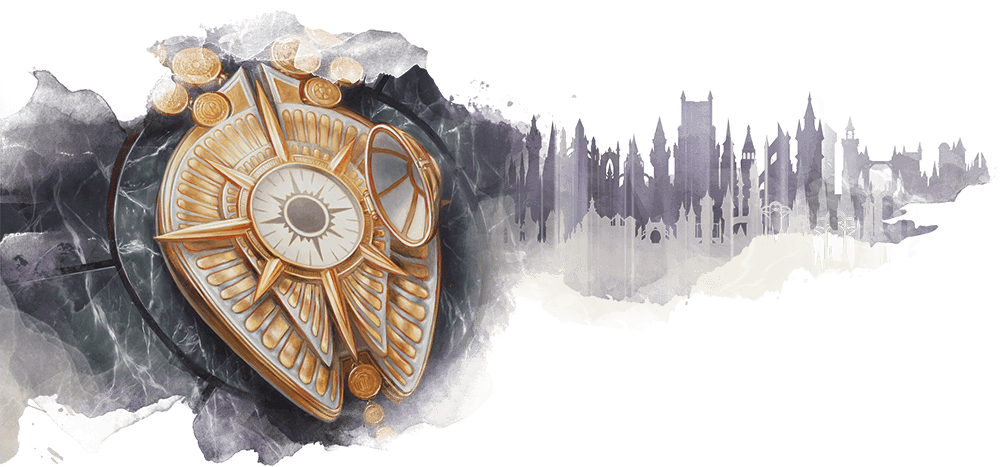
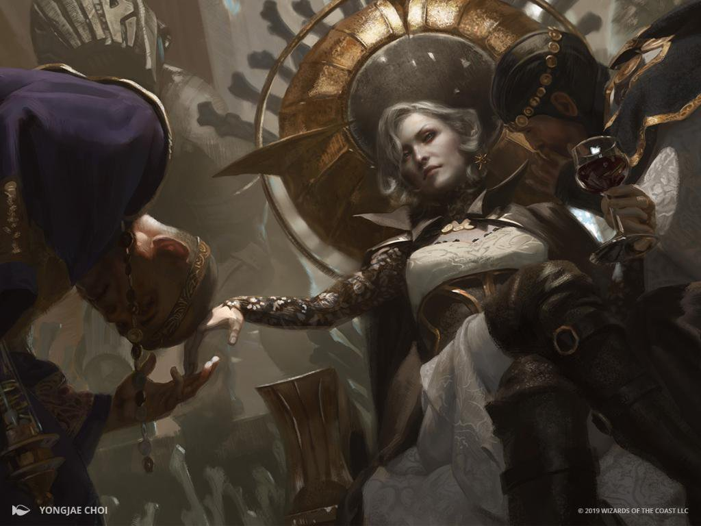

# Orzhov syndicate

Lorem ipsum.....

## Orzhov characters

**Alignment**: Usually X, often Y

**Sugested Races**: races

**Suggested Classes**: classes

You might enjoy a character who belongs in the Orzhov if one or more of the
following statements are true:

* Pariatur deserunt amet commodo consequat elit eiusmod duis laboris est mollit amet elit.
* Ut fugiat in consectetur sint ullamco eiusmod commodo nulla consectetur sit.
* Deserunt anim id ea voluptate adipisicing.
* Irure minim quis et ullamco amet nulla non veniam Lorem tempor reprehenderit.

## Character background: Orzhov representative

### How do I fit in

Amet exercitation in ad amet labore tempor excepteur aliquip irure nostrud.

**Skill proficiencies:**

* insight
* Intimidation

**Languages:**
Two of your choice

**Equipment:**

* An Orzhov insignia
* In ipsum proident id exercitation nostrud anim Lorem Lorem labore.
* Laboris velit culpa nostrud deserunt occaecat.
* Elit culpa enim voluptate officia culpa magna ipsum.

### Feature

### Orzhov guild spells

| **Spell level** | **Spells** |
| --------------- | ---------- |
| cantrip         |
| 1st             |
| 2nd             |
| 3rd             |
| 4th             |
| 5th             |

### Suggested characteristics

#### Personality traits

| **d8** | **Trait** |
| ------ | --------- |
| 1      |
| 2      |
| 3      |
| 4      |
| 5      |
| 6      |
| 7      |
| 8      |

#### Ideals

| **d6** | **Ideal** |
| ------ | --------- |
| 1      |
| 2      |
| 3      |
| 4      |
| 5      |
| 6      |

#### Bonds

| **d6** | **Bond** |
| ------ | -------- |
| 1      |
| 2      |
| 3      |
| 4      |
| 5      |
| 6      |

#### Flaws

| **d6** | **Flaw** |
| ------ | -------- |
| 1      |
| 2      |
| 3      |
| 4      |
| 5      |
| 6      |

### Orzhov contacts

| **d6** | **Contact** |
| ------ | ----------- |
| 1      |
| 2      |
| 3      |
| 4      |
| 5      |
| 6      |

### Non-Orzhov contacts

| **d10** | **Contact** |
| ------- | ----------- |
| 1       |
| 2       |
| 3       |
| 4       |
| 5       |
| 6       |
| 7       |
| 8       |
| 9       |
| 10      |
