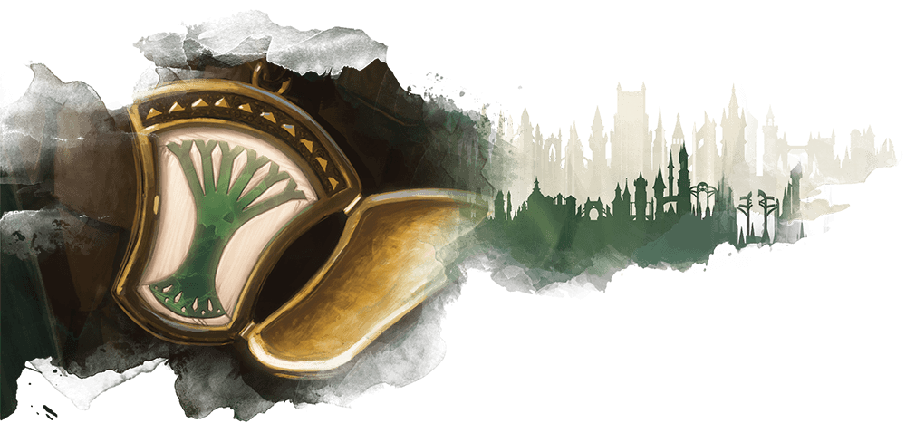
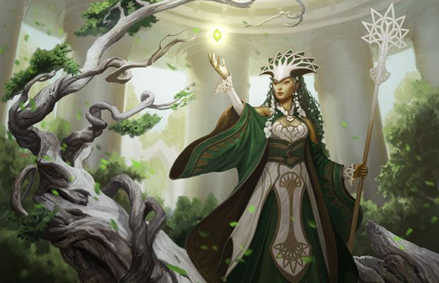

# Selesnya conclave

Deserunt nostrud tempor dolor dolore qui anim laborum.

## Selesnya characters

**Alignment**: Usually X, often Y

**Sugested Races**: races

**Suggested Classes**: classes

You might enjoy a character who belongs in the selesnya if one or more of the
following statements are true:

* Quis anim Lorem in qui.
* Anim elit sint nisi nisi est dolore deserunt esse quis Lorem sit cillum.
* Officia est sit sit duis reprehenderit officia et ex.
* Mollit ipsum amet irure id pariatur nostrud reprehenderit pariatur est non enim.

## Character background: Selesnya initiate

### How do I fit in

Dolor eu sunt laboris magna cillum ut reprehenderit qui cupidatat veniam cupidatat.

**Skill proficiencies:**

* insight
* Intimidation

**Languages:**
Two of your choice

**Equipment:**

* A selesnya insignia
* Quis quis ipsum nulla aute amet magna Lorem deserunt deserunt.
* Consequat ut mollit nostrud nostrud nisi non minim.
* Ipsum adipisicing laboris ea velit aliquip laboris nostrud exercitation aliqua ea ut.

### Feature

### Selesnya guild spells

| **Spell level** | **Spells** |
| --------------- | ---------- |
| cantrip         |
| 1st             |
| 2nd             |
| 3rd             |
| 4th             |
| 5th             |

### Suggested characteristics

#### Personality traits

| **d8** | **Trait** |
| ------ | --------- |
| 1      |
| 2      |
| 3      |
| 4      |
| 5      |
| 6      |
| 7      |
| 8      |

#### Ideals

| **d6** | **Ideal** |
| ------ | --------- |
| 1      |
| 2      |
| 3      |
| 4      |
| 5      |
| 6      |

#### Bonds

| **d6** | **Bond** |
| ------ | -------- |
| 1      |
| 2      |
| 3      |
| 4      |
| 5      |
| 6      |

#### Flaws

| **d6** | **Flaw** |
| ------ | -------- |
| 1      |
| 2      |
| 3      |
| 4      |
| 5      |
| 6      |

### Selesnya contacts

| **d6** | **Contact** |
| ------ | ----------- |
| 1      |
| 2      |
| 3      |
| 4      |
| 5      |
| 6      |

### Non-Selesnya contacts

| **d10** | **Contact** |
| ------- | ----------- |
| 1       |
| 2       |
| 3       |
| 4       |
| 5       |
| 6       |
| 7       |
| 8       |
| 9       |
| 10      |
