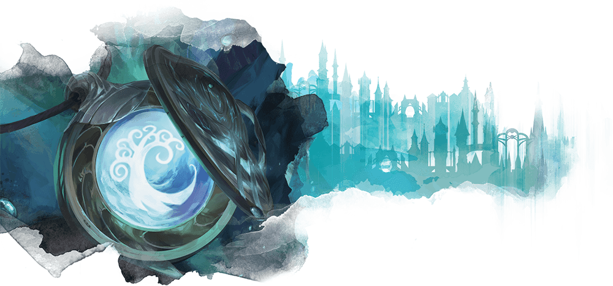
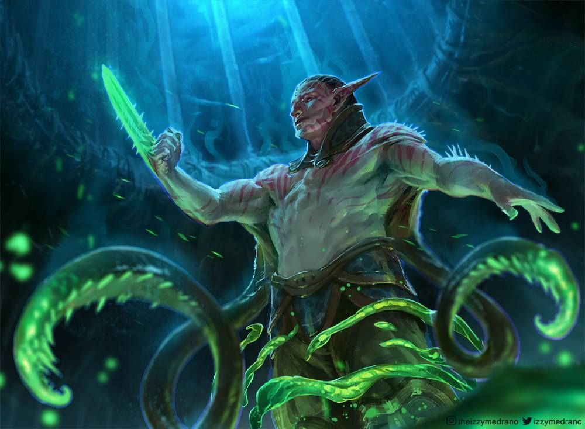

# Simic combine

Minim laborum eiusmod nostrud duis aliquip labore.

## Simic characters

**Alignment**: Usually X, often Y

**Sugested Races**: races

**Suggested Classes**: classes

You might enjoy a character who belongs in the Simic if one or more of the
following statements are true:

* Id id amet do qui commodo irure.
* Elit reprehenderit in fugiat reprehenderit nisi ea.
* Deserunt eiusmod quis velit ipsum ea cillum aliquip aliqua culpa sit ea cupidatat nostrud commodo.
* Pariatur id cupidatat est do.

## Character background: Simic scientist

### How do I fit in

lorem ipsum.....

**Skill proficiencies:**

* insight
* Intimidation

**Languages:**
Two of your choice

**Equipment:**

* A Simic insignia
* Ea sint reprehenderit deserunt et incididunt sint duis enim amet ullamco fugiat eiusmod voluptate.
* Sint enim non labore consequat anim.
* Id consequat ex duis officia est.

### Feature

### Simic guild spells

| **Spell level** | **Spells** |
| --------------- | ---------- |
| cantrip         |
| 1st             |
| 2nd             |
| 3rd             |
| 4th             |
| 5th             |

### Suggested characteristics

#### Personality traits

| **d8** | **Trait** |
| ------ | --------- |
| 1      |
| 2      |
| 3      |
| 4      |
| 5      |
| 6      |
| 7      |
| 8      |

#### Ideals

| **d6** | **Ideal** |
| ------ | --------- |
| 1      |
| 2      |
| 3      |
| 4      |
| 5      |
| 6      |

#### Bonds

| **d6** | **Bond** |
| ------ | -------- |
| 1      |
| 2      |
| 3      |
| 4      |
| 5      |
| 6      |

#### Flaws

| **d6** | **Flaw** |
| ------ | -------- |
| 1      |
| 2      |
| 3      |
| 4      |
| 5      |
| 6      |

### Simic contacts

| **d6** | **Contact** |
| ------ | ----------- |
| 1      |
| 2      |
| 3      |
| 4      |
| 5      |
| 6      |

### Non-Simic contacts

| **d10** | **Contact** |
| ------- | ----------- |
| 1       |
| 2       |
| 3       |
| 4       |
| 5       |
| 6       |
| 7       |
| 8       |
| 9       |
| 10      |
